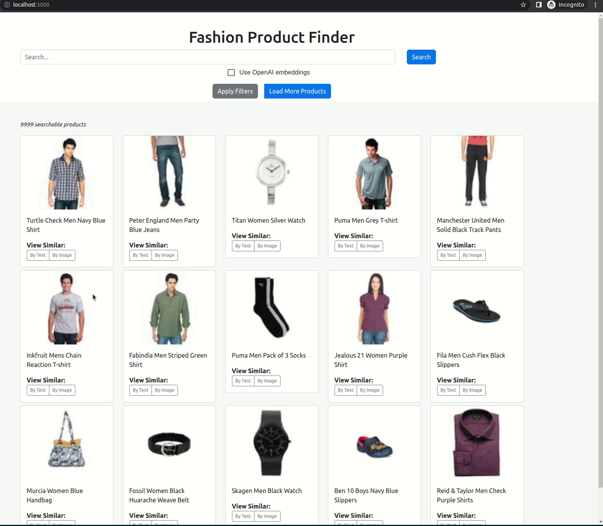

# OpenAI + Redis Vector Search Demo Application

This demo showcases the vector search similarity (VSS) with huggenface and OpenAI embedings.



### Datasets

The dataset was taken from the the following Kaggle links.

- [Large Dataset](https://www.kaggle.com/datasets/paramaggarwal/fashion-product-images-dataset)
- [Smaller Dataset](https://www.kaggle.com/datasets/paramaggarwal/fashion-product-images-small)


## Running the App
Before running the app, please install Docker first.

### Local Development

1. build redis-vector-db image 

    ```bash
    $ cd redis-vector-db
    $ docker build -t redis/redis-vector-db .
    ```

2. start the vector-db
    ```bash
    $ docker-compose up -d redis-vector-db
    ```

3. Create python virtual env
    ```bash
   $ python3 -m venv .venv
   $ source .venv/bin/activate
   $ pip install -r data/data-requirements.txt
   $ pip install -r app/requirements
    ```
4. Replace keys & path
   - Replase the text "your openai api key" in the code to your openai key 
   - Config proper proxy server address or set to empty string if it's not needed

4. prepare data
    - Download https://www.kaggle.com/datasets/paramaggarwal/fashion-product-images-small to gui/public/kk
    - Update resources path and run prep_data.ipynb, this will generate data/procuct_metadata.json, and data/product_vectors.openai.json

5. start the backend service
    ```bash
   $ cd app
   $ PYTHONPATH='.' python vecsim_app/load_data.py
   $ PYTHONPATH='.' python vecsim_app/main.py
    ```

6. start the frontend
   ```bash
   $ cd gui
   $ yarn
   $ yarn start
    ```

7. Navigate to `http://localhost:3000` in a browser.

## Application

This app was built as a Single Page Application (SPA) with the following components:

- **[Redis Stack](https://redis.io/docs/stack/)**: Vector database + JSON storage
- **[FastAPI](https://fastapi.tiangolo.com/)** (Python 3.8)
  - JWT authentication using [OAuth2 "password
    flow"](https://fastapi.tiangolo.com/tutorial/security/simple-oauth2/) and
    PyJWT
- **[Pydantic](https://pydantic-docs.helpmanual.io/)** for schema and validation
- **[React](https://reactjs.org/)** (with Typescript)
- **[Redis OM](https://redis.io/docs/stack/get-started/tutorials/stack-python/)** for ORM
- **[Docker Compose](https://docs.docker.com/compose/)** for development
- **[MaterialUI](https://material-ui.com/)** for some UI elements
- **[React-Bootstrap](https://react-bootstrap.github.io/)** for some UI elements
- **[react-admin](https://github.com/marmelab/react-admin)** for the admin dashboard
  - Using the same token based authentication as FastAPI backend (JWT)
- **[Pytorch/Img2Vec](https://github.com/christiansafka/img2vec)** and **[Huggingface Sentence Transformers](https://huggingface.co/sentence-transformers)** for vector embedding creation

Some inspiration was taken from this [Cookiecutter project](https://github.com/Buuntu/fastapi-react)
and turned into a SPA application instead of a separate front-end server approach.

## Notes:

This is project is forked from https://github.com/RedisVentures/redis-product-search, the major changes are:

- Removed unused codes
- Add OpenAI embeddings from comparison
